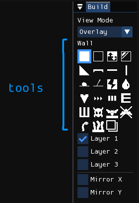
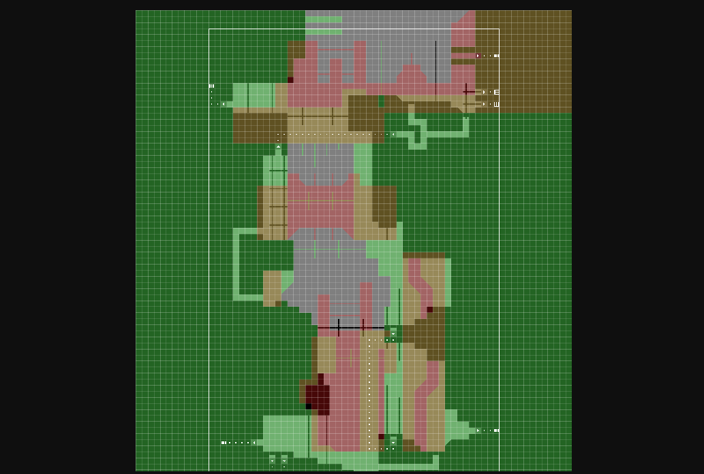
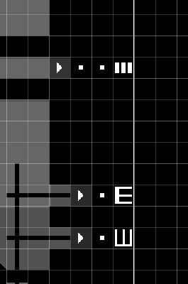
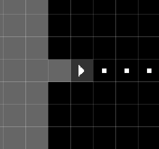
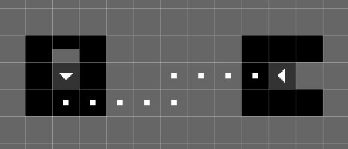
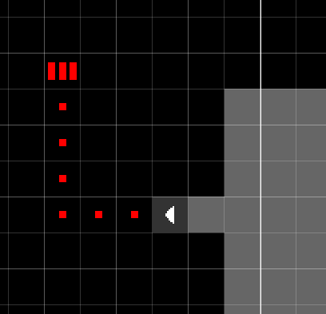

# Geometry
This edit mode is where you edit the room's geometry and some interactable objects. The window docked to the right, titled "Build", contains the tools you can use to edit the geometry and place objects, as well as some checkboxes for the layer mask and mirror options.

<figure markdown="span">
    
</figure>

## View mode
The view mode controls how each layer is composited in the level viewport.

- **Overlay**: The default view mode, emulates how layers are displayed in the original level editor. Each layer is rendered as a unique transparent color, except for the first layer which is an opaque black.
- **Stack**: Mimics how layers are displayed in RWE+, with all layers being an opaque black and closer layers obscuring the ones behind.

=== "Overlay"
    

=== "Stack"
    

## Tools
You may select a tool from the Build window by clicking on them or by using WASD navigation. Some tools are geometry tools, meaning that they modify the shape of the geometry associated with a cell, while others are object tools, meaning that they instead add or remove what objects are contained in a single cell.

With a tool selected, you can use it by pressing the left mouse button in the level viewport. Pressing the right mouse button will either erase geometry if a geometry tool is selected, or erase all objects in a cell if it is an object tool.

### Tool behavior
Some tools will modify what kind of geometry a cell uses, or modify what objects are contained in a cell. The tools that modify geometry, thus called "geometry tools" are "Wall", "Air", "Toggle Wall/Air", "Invisible Wall", "Slope", "Platform", and "Copy Backwards". Using this tool on a cell will overwrite what was placed by another tool of the same type. All of the other tools, called "object tools" instead add an object to the cell, meaning that using another tool of that type on the same cell will not overwrite what was previously placed.

If you press the right mouse button with a geometry tool selected, it will replace the cell with air. If you instead have an object tool selected, it will erase all objects in the cell. If an object tool is used on a cell that already contains the same object that the tool places, that specific object will instead be erased.

### Non-shortcut tools
Here is the list of tools not related to shortcuts:

| Tool | Description |
| -------- | ----------- |
|  Wall | Solid geometry. If a wall is placed on layer two, then background-climbing creatures like blue lizards can walk on it. |
|  Air | Empty space |
|  Toggle Wall/Air | Corresponds to "Inverse" in the official level editor. Should be obvious. |
|  Slope | A 45-degree slope. Can only be placed on corners. |
|  Invisible Wall | Corresponds to "Glass" in the official level editor. The cell will be collidable but invisible. |
|  Platform | A half-block. In game, you may freely pass through it if entering from the bottom, but in order to go through it from above, you have to hold the down button. |
| / Beam | Otherwise known as poles, creatures can climb on them. |
|  Fissure | Corresponds to "Crack Terrain" in the official level editor. You can use this to create a type of tunnel. It's not used in game often. For normal tunnels, you use air blocks. |
|  Waterfall | You use this to create decorative waterfalls. Water flows down from the cell that the waterfall object is placed in. |
|  Batfly Hive | Can only be placed on the ground. It makes those spiky white things that batflies burrow into. |
|  Forbid Fly Chain | Placed on the ceiling, and prevents batflies from hanging onto them in chains. |
|  Garbage Worm | Placed in the ground, and can be used to mark a location where a Garbage Worm spawns. |
|  Worm Grass | Placed on the ground. The height of the worm grass is proportional to the width of the patch. |
|  Copy Backwards | Copies the geometry of highlighted area one layer backwards. |

### Shortcuts
Shortcuts, otherwise known as "pipes", are used for inter- or intra-room transportation. Below are four examples of shortcuts. This one is a two-way connection between two points in the same room.

<figure markdown="span">
    
</figure>

This image below has three shortcuts. The first from the top transports creatures to a different room, the second from the top is a creature den, and third from the top is a Whack-A-Mole hole, transporting creatures to another Whack-A-Mole hole in the same room.

<figure markdown="span">
    
</figure>

Shortcut entrances have specific requirements in order to be recognized as valid. First, the 3x3 area of geometry around the shortcut entrance must be made of solid blocks, save for one block, where you enter the shortcut from, which should be either air or a platform (platforms are used for downward-facing shortcut entrances). So, for example, to create a shortcut entrance into a wall, you will place a single air block into the wall, and replace the next solid block in the hole with the shortcut entrance. Second, you must have a shortcut dot placed in the direction of the shortcut entrance. So, if you have an air block to the left of the shortcut entrance, you will need to begin the path of shortcut dots on the block to the right of the shortcut entrance.

If you have created a shortcut entrance correctly, the graphic for it will show an arrow pointing in the correct direction. Afterwards, you will use the "Shortcut Dot" tool to create a path for the shortcut. Each shortcut dot connects to the next. They will only connect on its four sides, so you can't have paths that go diagonally.

The other side of the shortcut path will be capped by one of several shortcut objects. The shortcut item that the path ends in changes the behavior of the shortcut.

| Tool | Description |
| -------- | ----------- |
|  Shortcut Entrance | Creates a two-way connection between two points in the same room.
|  Room Entrance | Creates a connection to another room. Known as the player entrance in the official level editor, and displayed as a "P" in other level editors. |
|  Creature Den | Known as the Dragon Den in the official level editor, a place for creatures other than the slugcat to spawn and hibernate in during the rain.
|  Whack-a-mole Hole | When a creature other than the slugcat enters this shortcut, they will be warped to another whack-a-mole hole in the same room, chosen at random.
|  Scavenger Hole | Allows scavengers to spawn in or travel to this room as they wander through a region.
|  Shortcut Dot | You can end a shortcut path with a shortcut dot. The shortcut will be valid, but not enterable.

Here are some examples of valid shortcuts:

=== "Shortcut in wall"
    

=== "Shortcut in floor"
    

=== "Floating shortcuts"
    

=== "No shortcut dots"
    

And here are some examples of invalid shortcuts:

=== "Invalid configuration"
    

=== "Outside of level border"
    

## Layer mask
There are three checkboxes below the tool selector labeled "Layer 1", "Layer 2", and "Layer 3". These checkboxes control the layer mask, which controls the layers tool interactions manipulate. You may enable/deactivate each layer by clicking on the checkboxes or by using the <kbd>E</kbd>, <kbd>R</kbd>, and <kbd>T</kbd> keys on your keyboard. Alternatively, you may press <kbd>Tab</kbd> to shift the layer mask downwards. If you have only one layer selected, this has the same effect as selecting the next layer.

## Mirroring
Below the layer mask configuration are the options for mirroring. The checkbox labeled "Mirror X", if enabled, will enable horziontal mirroring for tool interactions about the red line that will appear. "Mirror Y", if enabled, will do the same for vertical mirroring.

Each mirror split can be moved by clicking and dragging it. Holding down <kbd>Shift</kbd> while dragging a mirror split will snap it to the edges of cells, ignoring their centers. The split can be recentered by double-clicking on it.